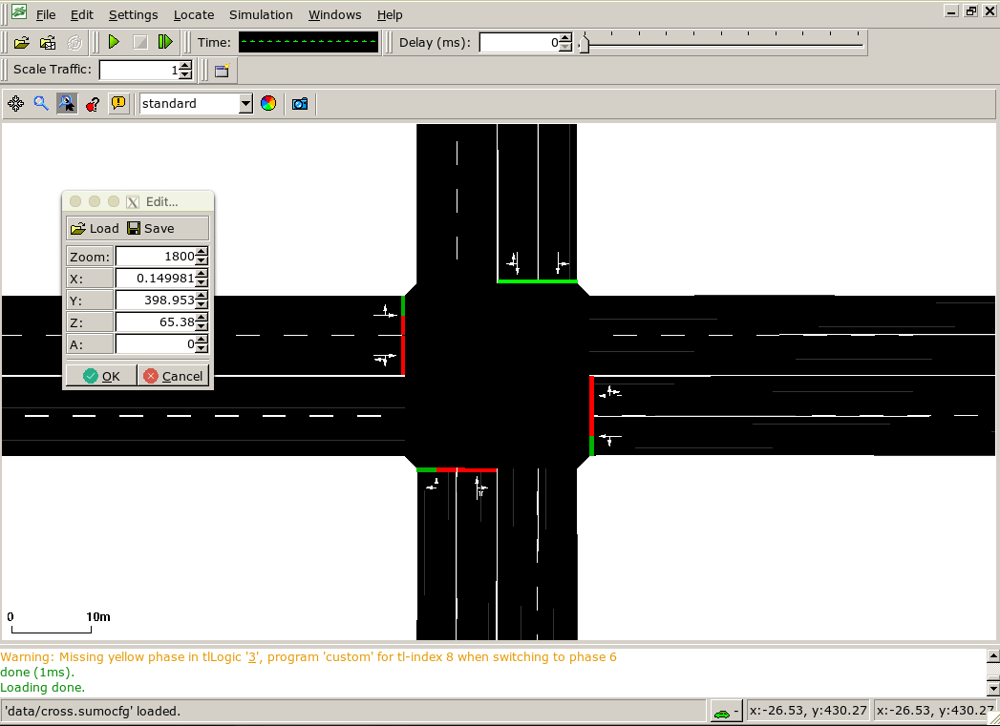
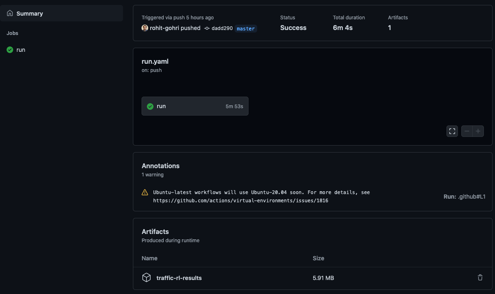

# TrafficRL

[](https://github.com/arorashu/trafficRL/actions?query=workflow%3ARun)

Adaptive Traffic Control System Using Reinforcment Learning.

This project aims to compare different RL methods for a Traffic Control System:

| Mode | Phasing  | Traffic State    | Learning Type | Action Selection |
|------|----------|------------------|---------------|------------------|
| 0    | -        | -                | -             | -                |
| 1    | Fixed    | Queue Length     | Q-Learning    | Epsilon Greedy   |
| 2    | Fixed    | Queue Length     | Q-Learning    | SoftMax          |
| 3    | Fixed    | Queue Length     | SARSA         | Epsilon Greedy   |
| 4    | Fixed    | Queue Length     | SARSA         | SoftMax          |
| 5    | Fixed    | Cumulative Delay | Q-Learning    | Epsilon Greedy   |
| 6    | Fixed    | Cumulative Delay | Q-Learning    | SoftMax          |
| 7    | Fixed    | Cumulative Delay | SARSA         | Epsilon Greedy   |
| 8    | Fixed    | Cumulative Delay | SARSA         | SoftMax          |
| 9    | Variable | Queue Length     | Q-Learning    | Epsilon Greedy   |
| 10   | Variable | Queue Length     | Q-Learning    | SoftMax          |
| 11   | Variable | Queue Length     | SARSA         | Epsilon Greedy   |
| 12   | Variable | Queue Length     | Q-Learning    | SoftMax          |
| 13   | Variable | Cumulative Delay | Q-Learning    | Epsilon Greedy   |
| 14   | Variable | Cumulative Delay | SARSA         | SoftMax          |
| 15   | Variable | Cumulative Delay | Q-Learning    | Epsilon Greedy   |
| 16   | Variable | Cumulative Delay | Q-Learning    | SoftMax          |

## Setup

1. Install SUMO v1.8.0: <http://sumo.dlr.de/wiki/Downloads>

1. Install MongoDB v4.2: Follow the official instructions at:

    <https://docs.mongodb.org/manual/tutorial/install-mongodb-on-ubuntu/> (for ubuntu)
    <https://docs.mongodb.com/manual/tutorial/install-mongodb-on-windows/> (for windows)

1. Install some required pip modules and update pip:

        python -m pip install --upgrade pip setuptools wheel

1. Clone the project using git and cd into it:

        git clone https://github.com/arorashu/trafficRL

        cd trafficRL

1. (Optionally) Install Virtual Env

        pip3 install virtualenv
        virtualenv .venv
        source .venv/bin/activate

1. Install requirements

        pip3 install -r requirements.txt

## Run

1. Ensure MongoDB is running, run this in the command line:

        mongo --eval "db.stats()"

  If it prints details of the database then everything is running successfully. If you get something like:

        [js] Error: couldn't connect to server 127.0.0.1:27017, connection attempt failed: SocketException: Error connecting to 127.0.0.1:27017 :: caused by :: Connection refused

  Then the mongo service has not started correctly.

1. Run project with python3:

        python runner.py -C 500



When running in GUI mode you will have to start the simulation manually and close Sumo only then will you get the results.

> NOTE: Ensure that SUMO_HOME path is defined in environment variables

### Usage: runner.py [options]

        -h, --help          show this help message and exit
        --nogui             run the commandline version of sumo
        -C NUM, --cars=NUM  specify the number of cars generated for simulation
        --bracket=BRACKET   specify the number with which to partition the range of
                                queue length/cumulative delay
        --learning=NUM      specify learning method (1 = Q-Learning, 2 = SARSA)
        --state=NUM         specify traffic state representation to be used (1 =
                                Queue Length, 2 = Cumulative Delay)
        --phasing=NUM       specify phasing scheme (1 = Fixed Phasing, 2 = Variable
                                Phasing)
        --action=NUM        specify action selection method (1 = epsilon greedy, 2 =
                                softmax)

The `outputs` folder will have plots for the average queue length.

### Automatically run all modes

        python automate.py  -C 1000 --nogui

This will run all the possible combinations for learning/state/phasing/action and print outputs. Total 17 modes (0-16). Can take a lot of time to run, depends on number of cars simulated.

### Results

You can see the results for a demo run with **200** cars in the [latest Github Actions workflow run.](https://github.com/arorashu/trafficRL/actions?query=workflow%3ARun)

Download the artifacts to view the outputs. For a more complete result you will have to run the simulation for a larger number of cars (~20000).



## Tech

### [SUMO](https://github.com/eclipse/sumo)

Last tested with Eclipse SUMO Version 1.8.0.

- [Traci](https://sumo.dlr.de/docs/TraCI.html)

### Mongo

Currently it expects mongo on localhost on the default port without any authentication. Last tested with Mongo v4.2.

## Development

### Map

The `data` directory has a simple map with 4 traffic crossings.

### Linting

For auto fixes use `autopep8`:

        ```sh
        autopep8 --in-place --aggressive  --exclude "__pycache__,.venv"  ./*.py
        ```
